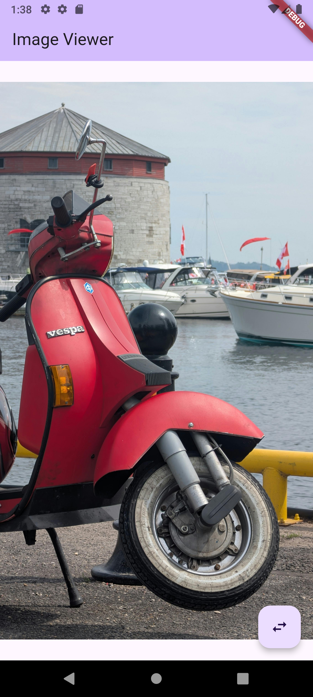
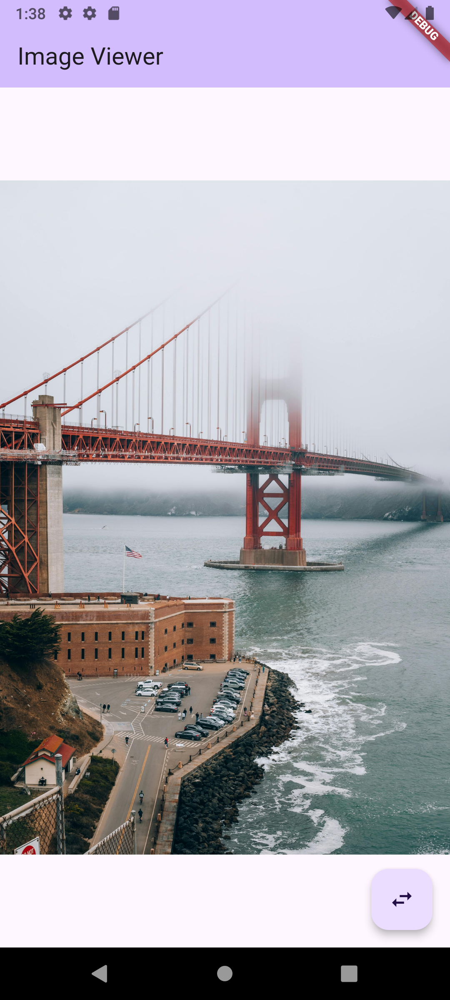
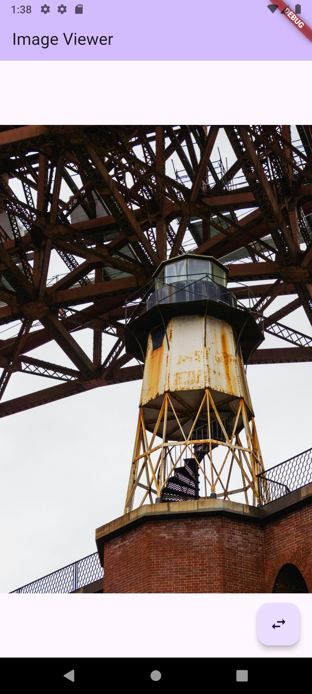

# image_viewer

A simple Flutter application that dynamically loads and displays all images from a local assets folder.

## Features

- **Dynamic Image Loading:** Automatically discovers and loads all images from the `assets/images/` directory without hardcoding file paths.
- **Simple Navigation:** Tap the button to cycle through the available images.
- **Loading State:** Displays a progress indicator while fetching the list of assets.
- **Empty State:** Shows a message if no images are found in the assets folder.

## Screenshots

<p align="center">
  
  &nbsp;&nbsp;&nbsp;&nbsp;
  
  <br><br>
  
  &nbsp;&nbsp;&nbsp;&nbsp;
  
</p>

## Getting Started

To get a local copy up and running, follow these simple steps.

1. **Clone the repository:**
   ```sh
   git clone https://github.com/your_username/image_viewer.git
   ```
2. **Navigate to the project directory:**
    ```sh
    cd image_viewer
    ```
3. **Add your images:**
   Place any `.jpg`, `.png`, or other image files inside the `assets/images/` directory.
4. **Install dependencies:**
   ```sh
   flutter pub get
   ```
5. **Run the app:**
   ```sh
   flutter run
   ```

## How It Works

The application avoids hardcoding asset paths by reading the `AssetManifest.json` file, which is automatically generated by Flutter during the build process. It filters the manifest to find all asset paths that begin with `assets/images/`. This list of paths is then used to populate the image viewer, making the gallery completely dynamic.
